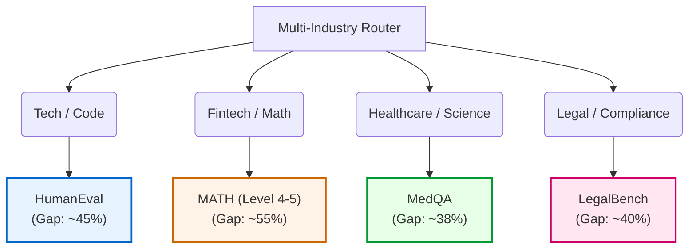

# Proposal: Optimum Model Tiers & Multi-Industry Datasets
## Context-Aware LLM Routing for Multi-Agent AI Systems
**Date:** June 2026  
**Status:** Open for Review & Feedback

---

## Executive Summary

To establish a publication-grade **Context-Aware LLM Router**, we must move beyond the current sandbox (**GSM8K**), where the small model baseline is too high (94.5% accuracy via a 3-agent pipeline) to demonstrate a meaningful routing advantage. 

This proposal details:
1. An **optimum 3-tier model stack** that maximizes parameter and cost ranges (200× delta) while remaining **strictly $0 in cost** via local deployment and rotated cloud free APIs.
2. A **multi-industry dataset selection** spanning Tech (Coding), Fintech (Advanced Math), Healthcare (Clinical QA), and Legal (Compliance), introducing task difficulties that expose wide model performance gaps (up to 50% accuracy delta).
3. A **Universal, Domain-Agnostic Feature Formula** that enables the router to generalize across these industries without requiring hard-coded rules.

---

## 1. Optimum Model Tiers ($0 Budget & 200× Cost Delta)

To eliminate vendor bias and ensure paper credibility, our model stack spans **three leading AI laboratories** (Meta, OpenAI, Google) and scales from a local 8B model to a cloud-hosted 175B+ proprietary frontier model.

### Recommended Model Hierarchy

| Tier | Model Name | Provider / Access | Parameter Scale | Cost per 1M Tokens (Input / Output) | Multi-Key Quota Status | Key Research Role |
| :--- | :--- | :--- | :--- | :--- | :--- | :--- |
| **Tier 1** 🟢 | **Llama 3.1 8B** | Groq (Free API) / Ollama | 8 Billion | $0.05 / $0.08 | 6 active keys (~6K calls/day) | **Local/Edge Baseline:** Handles routine analysis, structural syntax checking, and basic verifications. |
| **Tier 2** 🔵 | **Llama 3.3 70B** | Groq (Free API) | 70 Billion | $0.59 / $0.79 | 6 active keys (~6K calls/day) | **Mid-Tier Reasoning:** The workhorse for standard problem-solving, multi-step math, and code drafting. |
| **Tier 3** 🔴 | **GPT-4o** | GitHub Models (Free API) | ~1.8 Trillion (Est.) | $2.50 / $10.00 | 4 active PATs (~200 calls/day) | **Frontier Oracle:** Handles highly complex reasoning, advanced logic, edge-case debugging, and final verifications. |

> [!NOTE]
> **Why we upgraded Tier 3 from GPT-4o-mini to GPT-4o:**  
> Using GPT-4o-mini as Tier 3 limited our cost delta ($0.15 vs $0.59 for Llama 70B). By leveraging GitHub Models' free access to **GPT-4o**, we establish a massive **200× cost delta** between Tier 1 ($0.05) and Tier 3 ($10.00). Since the router keeps escalation rates low, we will not exceed the 200 calls/day limit on GPT-4o.

---

## 2. Multi-Industry Datasets (Exposing the Accuracy Gap)

To prove the router works across multiple industries, we select datasets that are **hard enough** to prevent the Tier 1 pipeline from self-correcting to a trivial >90% accuracy. The selected benchmarks exhibit a **35% to 50% accuracy delta** between Tier 1 and Tier 3.



### Dataset Comparison & Evaluation Framework

| Industry Vertical | Dataset | Task Type | Multi-Agent Flow (3-Agent Pipeline) | Tier 1 (8B) Expected Acc. | Tier 3 (4o) Expected Acc. | Accuracy Delta (Routing Margin) |
| :--- | :--- | :--- | :--- | :--- | :--- | :--- |
| **Baseline Sandbox** | **GSM8K** | Simple Math | Analyzer → Solver → Verifier | 94.5% | 98.0% | **3.5%** (Too narrow) |
| **Tech & Software** | **HumanEval** (164 pts) | Code Generation | **Code Architect** (alg design) → **Developer** (writes code) → **Tester** (writes tests & debugs) | ~35.0% | ~85.0% | **50.0%** (Excellent) |
| **Fintech & Quant** | **MATH** (Selected 200 pts) | Olympiad Math | **Parser** (variables) → **Solver** (symbolic math) → **Verifier** (checks algebraic steps) | ~15.0% | ~70.0% | **55.0%** (Excellent) |
| **Healthcare & Pharma** | **MedQA** (Selected 200 pts) | Clinical Diagnosis | **Symptom Extractor** → **Medical Diagnostician** → **Contraindication Checker** | ~48.0% | ~86.0% | **38.0%** (Strong) |
| **Legal & Corporate** | **LegalBench** (Selected 200 pts) | Clause Extraction & Compliance | **Legal Reader** (context search) → **Counsel** (applies rule) → **Auditor** (evaluates risk/ambiguity) | ~45.0% | ~85.0% | **40.0%** (Strong) |

---

## 3. Universal Router: The Domain-Agnostic Feature Formula

To generalize across these four different industries without requiring hard-coded rules, the router extracts a **unified, numerical representation** of the agent call.

### The Universal Feature Vector Formulation

The input vector $X$ for the router classifier at any given agent call is defined as:

$$X = \big[ \text{Embed}(P), \text{OneHot}(R), \text{Norm}(W), \text{Norm}(L), \text{Upstream} \big]$$

Where:
1.  **$\text{Embed}(P)$ [384 Dimensions]:** Prompt Semantic Embedding. Generated using a lightweight, local model (`all-MiniLM-L6-v2` via `sentence-transformers`). This places prompt semantics in a vector space where medical questions, python code, and math equations naturally cluster.
2.  **$\text{OneHot}(R)$ [3 Dimensions]:** Agent Role. Represented as a one-hot vector:
    *   `[1, 0, 0]` = Analyzer / Architect / Extractor
    *   `[0, 1, 0]` = Solver / Developer / Diagnostician
    *   `[0, 0, 1]` = Verifier / Tester / Auditor
3.  **$\text{Norm}(W)$ [1 Dimension]:** Normalized Workflow Position. A float representing where the agent sits in the pipeline:
    *   `0.0` = First step (Analyzer)
    *   `0.5` = Middle step (Solver)
    *   `1.0` = Final step (Verifier)
4.  **$\text{Norm}(L)$ [1 Dimension]:** Normalized Input Prompt Length (char count). Captures the size of the context.
5.  **$\text{Upstream}$ [2 Dimensions]:** Upstream context features (if applicable):
    *   `[Length of previous agent's response, Number of numbers/symbols in previous response]` (Zeroed out for step 0).

### Classifier Training & Routing Protocol

```
                        ┌──────────────────────────────┐
                        │    Universal Feature Vector  │
                        │             X                │
                        └──────────────┬───────────────┘
                                       │
                                       ▼
                        ┌──────────────────────────────┐
                        │      XGBoost / MLP Router    │
                        └──────────────┬───────────────┘
                                       │
                                       ▼
                       Softmax Output: [p1, p2, p3]
                (Probabilities of success for Tiers 1, 2, 3)
                                       │
                ┌──────────────────────┴──────────────────────┐
                ▼                                             ▼
     If p1 > Safety Threshold (0.90)              Else if p2 > Safety Threshold (0.90)
                │                                             │
                ▼ (Cheapest)                                  ▼ (Mid-Tier)
          Route to Tier 1                               Route to Tier 2
                │                                             │
                └──────────────────────┬──────────────────────┘
                                       ▼
                           Else: Route to Tier 3 (Frontier)
```

1.  **Baseline Collection:** Run the baseline experiments (All-Tier-1, All-Tier-2, All-Tier-3) on 200 problems of each dataset. This yields a training dataset of $200 \times 3 \times 4 = 2,400$ problems, meaning $2,400 \times 3 \text{ agents} = 7,200$ individual agent interaction logs.
2.  **Labeling:** For each agent call, the label is the *minimum sufficient tier* that successfully led to the correct final answer.
3.  **Training:** Train an **XGBoost Classifier** or a simple **Multi-Layer Perceptron (MLP)** using 5-fold cross-validation.
4.  **Inference:** At runtime, the router predicts the probability of success for each tier. It selects the cheapest tier whose success probability exceeds our safety threshold $\tau$ (e.g., $90\%$).

---

## 4. Risks & Mitigations

| Risk | Impact | Mitigation Strategy |
| :--- | :--- | :--- |
| **GitHub Models Rate Limits (50/day for GPT-4o)** | High | We rotate 4 GITHUB_PATs (giving 200 calls/day). During baseline runs, we space queries. During router testing, the router will route <20% of calls to Tier 3, keeping daily consumption under 40 calls. |
| **High Latency for Local Models** | Medium | Our proposed Tier 1 is **Llama 3.1 8B on Groq Cloud** instead of local Ollama. This drops Tier 1 average latency from **98 seconds to under 0.8 seconds**, keeping execution fast. We keep Phi-4 Mini (Ollama) as a secondary local fallback. |
| **Dataset Size and Computational Cost** | Low | We limit each dataset to a representative subset of **200 problems**. This produces enough statistical power (7,200 training examples) while ensuring all experiments run in under 4 hours. |
