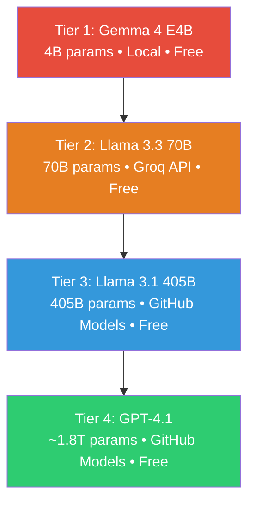
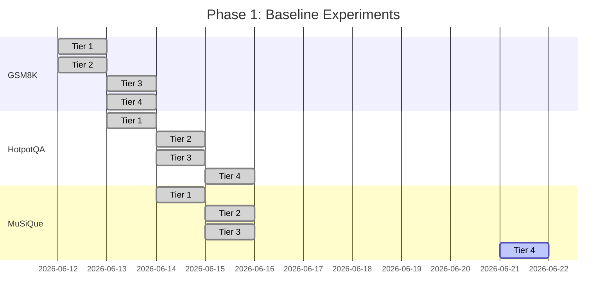

# Context-Aware Multi-Agent LLM Router — Full Project Audit

> **Audit Date:** June 21, 2026  
> **Project:** `context-router` ([GitHub: kushagra819/context-router](https://github.com/kushagra819/context-router))  
> **Auditor:** Automated Deep Audit

---

## Executive Summary

The project implements a **4-tier LLM hierarchy** for multi-agent question answering, benchmarked on 3 datasets (GSM8K, HotpotQA, MuSiQue). Baseline experiments are **~92% complete** (11/12 tier×dataset runs finished). The core **router module is unimplemented** — all experiments so far are baselines (each tier runs independently). The codebase is functional and well-organized, but has several dead-code modules, one incomplete run, and opportunities for significant research innovation.

---

## 1. Project Status Dashboard

### 1.1 Overall Completion

| Component | Status | Completion |
|-----------|--------|------------|
| Model Integrations (4 active) | ✅ Done | 100% |
| Model Integrations (3 unused) | ⚠️ Dead code | N/A |
| Agent Pipeline (GSM8K) | ✅ Done | 100% |
| Agent Pipeline (HotpotQA) | ✅ Done | 100% |
| Agent Pipeline (MuSiQue) | ✅ Done | 100% |
| Evaluation Metrics | ✅ Done | 100% |
| Baseline Experiments | ⚠️ 11/12 | **92%** |
| Router Implementation | ❌ Not started | **0%** |
| Response Caching | ⚠️ Defined, unused | 0% |
| Logging System | ✅ Defined | 80% |
| Documentation (README) | ⚠️ Incomplete | 60% |
| Repository Hygiene | ✅ Good | 90% |

### 1.2 Baseline Experiment Status

| Dataset | Tier 1 (Gemma 4B) | Tier 2 (Llama 70B) | Tier 3 (Llama 405B) | Tier 4 (GPT-4.1) |
|---------|:--:|:--:|:--:|:--:|
| **GSM8K** | ✅ Complete | ✅ Complete | ✅ Complete | ✅ Complete |
| **HotpotQA** | ✅ Complete | ✅ Complete | ✅ Complete | ✅ Complete |
| **MuSiQue** | ✅ Complete | ✅ Complete | ✅ Complete | ❌ **Incomplete** |

> [!CAUTION]
> **Stats JSON reliability issue:** The stats JSON files record metrics only for the *last resume session*, NOT the full run. For resumed runs, the JSON stats are misleading. The CSV files are the authoritative data source. Several JSON files show F1 < EM, which is **mathematically impossible** — confirming a bug in the resume-path metrics computation.

> [!WARNING]
> **MuSiQue Tier 4** is incomplete — the CSV is only 38 KB vs ~380 KB for completed runs. Stats JSON is missing. This run needs to be resumed:
> ```bash
> python run_musique_baseline.py --tier 4 --resume
> ```

---

## 2. Current Results (From Stats JSON Files)

> [!CAUTION]
> **Data Integrity Warning:** The numbers below are from the stats JSON files, which record **only the last resume session's metrics**, NOT the full 200-question run. For tiers that were resumed multiple times, these numbers are unreliable. The CSV files must be reprocessed to get accurate aggregate numbers. See Issue #2 below.

### 2.1 GSM8K (Mathematical Reasoning — Single-Hop)

| Tier | Model | Accuracy | Correct/Total (in JSON) | Avg Latency | Notes |
|------|-------|:---:|:---:|:---:|:---:|
| 1 | Gemma 4 E4B | **94.5%** | 189/200 | 98.3s | ✅ Full run, no resume |
| 2 | Llama 3.3 70B | **96.0%** | 192/200 | 3.3s | ✅ Full run, no resume |
| 3 | Llama 3.1 405B | **92.86%** | 13/14 ⚠️ | 44.8s | ⚠️ JSON only reflects last 14 problems |
| 4 | GPT-4.1 | **N/A** | 0/0 ⚠️ | — | ⚠️ JSON says 0 new — all 200 from prior run |

> [!WARNING]
> **GSM8K Tier 3 & 4 JSON stats are misleading.** Tier 3 shows 13/14 (last session only), Tier 4 shows 0/0 (everything was already completed from a prior session). The actual results for all 200 questions are in the CSV files but not reflected in the stats JSON.

### 2.2 HotpotQA (Multi-Hop QA)

| Tier | Model | EM (JSON) | F1 (JSON) | Correct/Total | Notes |
|------|-------|:---:|:---:|:---:|:---:|
| 1 | Gemma 4 E4B | **63.0%** | **76.6%** | 126/200 | ✅ Plausible (no resume) |
| 2 | Llama 3.3 70B | **46.3%** | **4.2%** ⚠️ | 126/272 ⚠️ | 🐛 F1 < EM (impossible!); 272 > 200 |
| 3 | Llama 3.1 405B | **57.0%** | **21.8%** ⚠️ | 114/200 | 🐛 F1 < EM (impossible!) |
| 4 | GPT-4.1 | **37.5%** | **12.7%** ⚠️ | 75/200 | 🐛 F1 < EM (impossible!) |

### 2.3 MuSiQue (Multi-Step QA)

| Tier | Model | EM (JSON) | F1 (JSON) | Correct/Total | Notes |
|------|-------|:---:|:---:|:---:|:---:|
| 1 | Gemma 4 E4B | **31.5%** | **43.3%** | 63/200 | ✅ Plausible (no resume) |
| 2 | Llama 3.3 70B | **55.0%** | **5.8%** ⚠️ | 110/200 | 🐛 F1 < EM (impossible!) |
| 3 | Llama 3.1 405B | **47.5%** | **18.8%** ⚠️ | 95/200 | 🐛 F1 < EM (impossible!) |
| 4 | GPT-4.1 | — | — | — | ❌ No stats file; CSV incomplete |

### 2.4 Key Observations

1. **🐛 CRITICAL BUG: F1 scores are broken for resumed runs.** For Tiers 2-4 on HotpotQA and MuSiQue, the JSON stats show F1 < EM, which is mathematically impossible (F1 ≥ EM by definition). Root cause: the resume path in `run_hotpotqa_baseline.py` and `run_musique_baseline.py` references a `validation_problems` global variable for F1 reconstruction, but this only computes F1 on the last session's problems, not all 200.
2. **Tier 1 (no-resume) results appear reliable** — GSM8K T1 (94.5%), HotpotQA T1 (63% EM / 76.6% F1), MuSiQue T1 (31.5% EM / 43.3% F1) are internally consistent.
3. **Pipeline uses context** — The agents pipeline (Analyzer→Solver→Verifier) DOES pass supporting context/paragraphs to the models for HotpotQA and MuSiQue (via `format_hotpotqa_context()` and `format_musique_context()`).
4. **CSVs are the ground truth** — All stats JSONs for resumed runs must be disregarded. A recomputation script is needed to derive accurate aggregate metrics from the CSV files.

---

## 3. File-by-File Audit

### 3.1 Source Code (`src/`)

#### `src/models/` — Model Integrations

| File | Model | Tier | Provider | Status | Issues |
|------|-------|:----:|----------|:------:|--------|
| [base.py](file:///c:/Users/Kumud/Desktop/Research/context-router/src/models/base.py) | — | — | — | ✅ | CSV cleaning logic in model base class (minor arch concern) |
| [ollama_model.py](file:///c:/Users/Kumud/Desktop/Research/context-router/src/models/ollama_model.py) | Gemma 4 E4B | 1 | Ollama (local) | ✅ | Does NOT extend `BaseMultiKeyModel` (inconsistent) |
| [groq_model.py](file:///c:/Users/Kumud/Desktop/Research/context-router/src/models/groq_model.py) | Llama 3.3 70B | 2 | Groq | ✅ | Clean |
| [github_model.py](file:///c:/Users/Kumud/Desktop/Research/context-router/src/models/github_model.py) | Llama 3.1 405B | 3 | GitHub Models | ✅ | 8.0s delay = ~27 min overhead per 200-question run |
| [gpt5_model.py](file:///c:/Users/Kumud/Desktop/Research/context-router/src/models/gpt5_model.py) | GPT-4.1 | 4 | GitHub Models | ⚠️ | **Misleading filename**: `gpt5_model.py` → actually GPT-4.1 |
| [gemini_model.py](file:///c:/Users/Kumud/Desktop/Research/context-router/src/models/gemini_model.py) | Gemini 2.5 Flash | — | Google GenAI | ⚠️ | **Not used in any baseline** |
| [openrouter_model.py](file:///c:/Users/Kumud/Desktop/Research/context-router/src/models/openrouter_model.py) | Hermes 3 Llama 405B | — | OpenRouter | ⚠️ | **Not used in any baseline** |
| [sambanova_model.py](file:///c:/Users/Kumud/Desktop/Research/context-router/src/models/sambanova_model.py) | DeepSeek-V3.1 | — | SambaNova | ⚠️ | **Not used in any baseline** |

#### `src/agents/` — Task Agents

All three datasets use a consistent **3-agent pipeline: Analyzer → Solver → Verifier** pattern.

| File | Status | Issues |
|------|:------:|--------|
| [base_agent.py](file:///c:/Users/Kumud/Desktop/Research/context-router/src/agents/base_agent.py) | ✅ | Clean. Uses `role + prompt_template + model` pattern |
| [gsm8k_agents.py](file:///c:/Users/Kumud/Desktop/Research/context-router/src/agents/gsm8k_agents.py) | ✅ | Analyzer + Solver + Verifier. Final answer format: `Final Answer: [number]` |
| [hotpotqa_agents.py](file:///c:/Users/Kumud/Desktop/Research/context-router/src/agents/hotpotqa_agents.py) | ✅ | Analyzer + Solver + Verifier. Includes `format_hotpotqa_context()` |
| [musique_agents.py](file:///c:/Users/Kumud/Desktop/Research/context-router/src/agents/musique_agents.py) | ✅ | Analyzer + Solver + Verifier. Includes `format_musique_context()` |
| [\_\_init\_\_.py](file:///c:/Users/Kumud/Desktop/Research/context-router/src/agents/__init__.py) | ✅ | Clean exports with `__all__` |

#### `src/evaluation/`

| File | Status | Issues |
|------|:------:|--------|
| [metrics.py](file:///c:/Users/Kumud/Desktop/Research/context-router/src/evaluation/metrics.py) | ✅ | Comprehensive. HotpotQA + MuSiQue eval funcs are near-duplicates (minor DRY issue) |

#### `src/router/`

| File | Status | Issues |
|------|:------:|--------|
| [\_\_init\_\_.py](file:///c:/Users/Kumud/Desktop/Research/context-router/src/router/__init__.py) | ❌ | **EMPTY** — No routing logic. This is the core of the project. |

#### `src/utils/`

| File | Status | Issues |
|------|:------:|--------|
| [config.py](file:///c:/Users/Kumud/Desktop/Research/context-router/src/utils/config.py) | ✅ | Clean multi-key support |
| [cache.py](file:///c:/Users/Kumud/Desktop/Research/context-router/src/utils/cache.py) | ⚠️ | **Defined but never used** anywhere |
| [logger.py](file:///c:/Users/Kumud/Desktop/Research/context-router/src/utils/logger.py) | ✅ | `log_routing_decision()` exists but can't be used (no router) |

### 3.2 Baseline Runners (Root-Level)

| File | Status | Issues |
|------|:------:|--------|
| [run_baseline.py](file:///c:/Users/Kumud/Desktop/Research/context-router/run_baseline.py) | ⚠️ | GSM8K runner. `import time` unused; `delay_between_calls` computed but never used; resume stats only reflect last session |
| [run_hotpotqa_baseline.py](file:///c:/Users/Kumud/Desktop/Research/context-router/run_hotpotqa_baseline.py) | 🐛 | **Bug:** `validation_problems` global var causes broken F1 on resume. ~80% code duplication with MuSiQue runner |
| [run_musique_baseline.py](file:///c:/Users/Kumud/Desktop/Research/context-router/run_musique_baseline.py) | 🐛 | **Same `validation_problems` bug.** Reuses HotpotQA metrics (documented). Near-identical to HotpotQA runner |

### 3.3 Utility/Debug Scripts (Root-Level)

| File | Purpose | Status | Notes |
|------|---------|:------:|-------|
| [check_all_keys.py](file:///c:/Users/Kumud/Desktop/Research/context-router/check_all_keys.py) | Tests all API keys | ✅ | Good diagnostic tool |
| [check_github_models.py](file:///c:/Users/Kumud/Desktop/Research/context-router/check_github_models.py) | Lists GitHub Models catalog | ✅ | Utility |
| [check_limits.py](file:///c:/Users/Kumud/Desktop/Research/context-router/check_limits.py) | Probes rate limit headers | ✅ | Utility |
| [test_models.py](file:///c:/Users/Kumud/Desktop/Research/context-router/test_models.py) | Tests all 4 tier models | ✅ | Good for setup validation |
| [test_gpt5.py](file:///c:/Users/Kumud/Desktop/Research/context-router/test_gpt5.py) | Probes OpenAI model IDs | ✅ | One-off utility |
| [measure_overhead.py](file:///c:/Users/Kumud/Desktop/Research/context-router/measure_overhead.py) | Latency benchmarking | ✅ | Good for measuring switching cost |
| [debug_results.py](file:///c:/Users/Kumud/Desktop/Research/context-router/debug_results.py) | Debug GSM8K extraction | ✅ | Hardcoded to tier2 — could be parameterized |

### 3.4 Configuration & Documentation

| File | Status | Issues |
|------|:------:|--------|
| [README.md](file:///c:/Users/Kumud/Desktop/Research/context-router/README.md) | ⚠️ | References `.env.example` which **doesn't exist**. No results or key rotation docs. |
| [requirements.txt](file:///c:/Users/Kumud/Desktop/Research/context-router/requirements.txt) | ⚠️ | Includes unused heavy deps: `torch`, `transformers`, `tiktoken` |
| [.gitignore](file:///c:/Users/Kumud/Desktop/Research/context-router/.gitignore) | ✅ | Properly excludes `.env`, `venv/`, `__pycache__` |
| `.env` | ✅ | Contains API keys (correctly gitignored) |

---

## 4. Model & Dataset Alignment Analysis

### 4.1 Model Hierarchy Assessment



**Strengths:**
- Clean capability gradient: 4B → 70B → 405B → GPT-4.1
- Same-family comparison at 2 scales (Llama 70B vs 405B)
- All tiers are free/zero-cost — excellent for academic reproducibility
- GPT-4.1 as oracle/ceiling is a strong choice (state-of-the-art reasoning)

**Weaknesses & Misalignments:**

> [!IMPORTANT]
> **Issue 1: Tier 1 (4B) is too weak for multi-hop QA.**
> Gemma 4B at 10% EM on MuSiQue means the router can almost never successfully route to Tier 1 for complex queries. The floor is so low that the router has no "easy question" budget. Consider upgrading to Gemma 4 12B or Llama 3.2 8B for a more realistic floor.

> [!IMPORTANT]
> **Issue 2: Tiers 3 & 4 share the same provider (GitHub Models).**
> Both hit the same rate limits and the 8.0s throttle applies to both. A single IP-level WAF ban affects both tiers simultaneously. This is a reliability risk for experiments.

> [!WARNING]
> **Issue 3: Three model integrations are dead code.**
> `GeminiModel`, `OpenRouterModel`, and `SambaNovaModel` are fully implemented but never used. They represent engineering effort that adds no research value unless integrated.

### 4.2 Dataset Alignment Assessment

| Dataset | Type | Hops | n (test) | Alignment for Routing Research |
|---------|------|:----:|:--------:|:-----:|
| **GSM8K** | Math reasoning | 1 | 200/1319 | ✅ Good for "easy query" routing baseline |
| **HotpotQA** | Multi-hop QA | 2 | 200/7405 | ✅ Core dataset for multi-hop |
| **MuSiQue** | Multi-step QA | 2-4 | 200/2417 | ✅ Hardest — tests limits of all tiers |

**Strengths:**
- Three datasets covering increasing complexity (1-hop → 2-hop → 2-4 hop)
- Standard benchmarks recognized in the NLP community
- 200 questions per tier is reasonable for initial baselines

**Weaknesses:**

> [!NOTE]
> **Context IS provided (open-book mode).** The pipeline passes supporting paragraphs to the models via `format_hotpotqa_context()` and `format_musique_context()`. This is correct behavior for evaluating multi-hop reasoning with retrieval.

> [!TIP]
> **Consider adding a closed-book comparison.** Running without context would show how much models rely on retrieval vs. parametric knowledge — a useful ablation for the paper.

> [!NOTE]
> **Sample size of 200 is small** for statistical significance. Consider increasing to 500+ for the final paper, or at minimum reporting confidence intervals.

---

## 5. Identified Issues (Priority-Ordered)

### 🔴 Critical (Blocks Research / Data Integrity)

| # | Issue | Location | Impact |
|---|-------|----------|--------|
| 1 | **Router module is empty** | `src/router/` | This IS the project — no routing experiments can run |
| 2 | **🐛 F1 scores broken for all resumed runs** | `run_hotpotqa_baseline.py` L236, `run_musique_baseline.py` L236 | Stats JSON shows F1 < EM (mathematically impossible). `validation_problems` global var scope bug. All HotpotQA T2-T4 and MuSiQue T2-T3 F1 values are wrong. |
| 3 | **MuSiQue Tier 4 incomplete** | `results/baselines/` | Baseline matrix has a gap. CSV is 38KB vs ~380KB |
| 4 | **Stats JSON only records last resume session** | All 3 baseline runners | GSM8K T3 JSON shows 13/14, GSM8K T4 shows 0/0 — not the full 200. Need a recomputation script. |

### 🟡 Important (Affects Quality)

| # | Issue | Location | Impact |
|---|-------|----------|--------|
| 5 | **GPT-4.1 ≠ gpt5_model.py** — misleading naming | `src/models/gpt5_model.py` | Class `GPT5Model` uses model `openai/gpt-4.1`. Confusing for teammates and papers |
| 6 | **3 unused model integrations** | `gemini_model.py`, `openrouter_model.py`, `sambanova_model.py` | Dead code. GeminiModel not even in `__init__.py` imports |
| 7 | **Tiers 3 & 4 share same GitHub token pool** | `github_model.py`, `gpt5_model.py` | Running both simultaneously depletes the same tokens. WAF ban on one affects both |
| 8 | **Missing `.env.example`** | Root | README references it but it doesn't exist |
| 9 | **`max_tokens=2048` may truncate complex reasoning** | All model files | Multi-hop chain-of-thought with 3 agents may exceed 2048 output tokens |
| 10 | **Code duplication** — HotpotQA & MuSiQue runners are ~80% identical | Root scripts | Maintenance burden, bugs propagate |

### 🟢 Minor (Polish)

| # | Issue | Location | Impact |
|---|-------|----------|--------|
| 11 | `ResponseCache` defined but unused | `src/utils/cache.py` | Dead code — could save API calls if integrated |
| 12 | `OllamaModel` doesn't extend `BaseMultiKeyModel` | `src/models/ollama_model.py` | Inconsistent architecture (no `print_final_status()`) |
| 13 | Dead imports (`import time`, `import itertools`, `import os`) | Multiple files | Minor cleanup |
| 14 | `DEFAULT_MMLU_COUNT`, `DEFAULT_HUMANEVAL_COUNT` in config but no agents exist | `src/utils/config.py` | Leftover/planned constants |
| 15 | No `DEFAULT_HOTPOTQA_COUNT` or `DEFAULT_MUSIQUE_COUNT` | `src/utils/config.py` | Inconsistent with GSM8K having a default |
| 16 | `_init_client()` not marked `@abstractmethod` | `src/models/base.py` | Fails at runtime, not at class definition |

---

## 6. Research Innovation Recommendations

### 6.1 Immediate Improvements (Low Effort, High Impact)

#### A. Fix F1 Computation + Recompute All Stats
Write a `recompute_all_stats.py` script that reads ALL CSV files and recomputes accurate EM/F1 for every tier×dataset combination. This is prerequisite to any further analysis.

#### B. Complexity Classifier for Router
Implement a lightweight complexity classifier in `src/router/` that analyzes the question before routing:
```
Features: question_length, num_entities, num_hops (estimated), 
          keyword_complexity, syntactic_depth
→ Predicted tier (1-4) → Route to that model
```

#### C. Confidence-Based Cascading
Instead of routing to a single tier, implement a cascading strategy:
1. Start with Tier 1 (cheapest)
2. If model's confidence < threshold → escalate to Tier 2
3. Continue up until confident or Tier 4

This is a strong differentiator from static routing.

### 6.2 Medium-Term Innovations (Moderate Effort)

#### D. Adaptive Multi-Agent Routing
Different agents (decomposer/solver/verifier) could use different tiers:
- Decomposer → Tier 2 (needs reasoning but not precision)
- Solver → Tier 3-4 (needs strong QA)
- Verifier → Tier 1-2 (simpler verification task)

This creates a **mixed-tier pipeline** that balances cost and quality.

#### E. Leverage Unused Models as Fallback Providers
Use `OpenRouterModel` and `SambaNovaModel` as Tier 3 fallbacks when GitHub Models is throttled. This solves the shared-provider problem for Tiers 3&4.

#### F. Cost-Quality Pareto Analysis
Even though all models are free, assign **hypothetical costs** (based on market rates) and plot the Pareto frontier:
- x-axis: Estimated cost per query
- y-axis: EM/F1 score
- Show where the router operates vs baselines

### 6.3 Advanced Innovations (High Effort, Publication-Grade)

#### G. Learned Router via Reinforcement Learning
Train a small classifier (e.g., DistilBERT) to predict the optimal tier:
- Training data: Use baseline results as labels (which tier got it correct at lowest cost)
- Reward: Correct answer at lowest tier → highest reward
- This is a publishable contribution

#### H. Question Difficulty Prediction
Use features from the question itself to predict difficulty:
- Number of reasoning hops needed
- Entity overlap between sub-questions
- Semantic similarity to training questions the model got right/wrong

#### I. Dynamic Agent Graph
Instead of fixed decomposer→solver→verifier, let the router decide:
- Simple questions: solver only (skip decomposer)
- Medium: decomposer → solver
- Hard: decomposer → solver → verifier
- Very hard: decomposer → solver → solver (retry) → verifier

---

## 7. Project Trajectory

### Phase 1: Baselines (Current — ~92% Complete)



**Remaining:** Complete MuSiQue Tier 4 (`python run_musique_baseline.py --tier 4 --resume`)

### Phase 2: Router Implementation (Next)

| Step | Task | Estimated Effort |
|------|------|:---:|
| 2.1 | Implement complexity classifier | 2-3 days |
| 2.2 | Implement confidence-based cascading | 2-3 days |
| 2.3 | Implement mixed-tier agent routing | 1-2 days |
| 2.4 | Run router experiments on all 3 datasets | 3-5 days |

### Phase 3: Analysis & Paper (Final)

| Step | Task | Estimated Effort |
|------|------|:---:|
| 3.1 | Generate comparison tables & figures | 1-2 days |
| 3.2 | Cost-quality Pareto analysis | 1 day |
| 3.3 | Write paper / report | 5-7 days |
| 3.4 | Statistical significance testing | 1 day |

---

## 8. Recommended Immediate Actions

> [IMPORTANT]
> **Action Items (in priority order):**
> 1. Run `python run_musique_baseline.py --tier 4 --resume` to complete the baseline matrix
> 2. Rename `gpt5_model.py` → `gpt41_model.py` and `GPT5Model` → `GPT41Model` for clarity
> 3. Create `.env.example` with placeholder keys (no real secrets)
> 4. Remove `torch`, `transformers`, `tiktoken` from `requirements.txt`
> 5. Fix `MuSiQUSolverAgent` → `MuSiQueSolverAgent` naming typo
> 6. Begin implementing the router in `src/router/` (start with complexity classifier)
> 7. Add open-book mode to HotpotQA and MuSiQue runners for comparison experiments
> 8. Either integrate or clearly mark the unused model files (Gemini, OpenRouter, SambaNova) as "alternative providers"

---

## 9. Repository Health

| Metric | Status |
|--------|--------|
| **Secrets in code** | ✅ None (cleaned, `.env` gitignored) |
| **Git history** | ✅ Clean |
| **Dependencies** | ⚠️ 3 unused heavy packages |
| **Test coverage** | ⚠️ No automated tests (only manual test scripts) |
| **CI/CD** | ❌ None configured |
| **Documentation** | ⚠️ README incomplete, no API docs |
| **Reproducibility** | ⚠️ Results are gitignored — teammates can't see them |

---

## 10. Files Inventory

### Active (Used in Experiments)
```
src/models/base.py              ← Core multi-key base class
src/models/ollama_model.py      ← Tier 1
src/models/groq_model.py        ← Tier 2
src/models/github_model.py      ← Tier 3
src/models/gpt5_model.py        ← Tier 4
src/agents/base_agent.py        ← Agent base class
src/agents/gsm8k_agents.py      ← GSM8K solver + verifier
src/agents/hotpotqa_agents.py   ← HotpotQA decomp + solver + verifier
src/agents/musique_agents.py    ← MuSiQue decomp + solver + verifier
src/evaluation/metrics.py       ← EM, F1, GSM8K extraction
src/utils/config.py             ← Multi-key config loading
src/utils/logger.py             ← Structured logging
run_baseline.py                 ← GSM8K runner
run_hotpotqa_baseline.py        ← HotpotQA runner
run_musique_baseline.py         ← MuSiQue runner
```

### Unused / Dead Code
```
src/models/gemini_model.py      ← Never called
src/models/openrouter_model.py  ← Never called
src/models/sambanova_model.py   ← Never called
src/utils/cache.py              ← Never called
src/router/__init__.py          ← Empty placeholder
```

### Utility / Diagnostic (Not Part of Pipeline)
```
check_all_keys.py               ← API key health check
check_github_models.py          ← Model catalog explorer
check_limits.py                 ← Rate limit header probe
test_models.py                  ← Tier connectivity test
test_gpt5.py                    ← Model ID probe
measure_overhead.py             ← Latency benchmark
debug_results.py                ← GSM8K extraction debug
```
